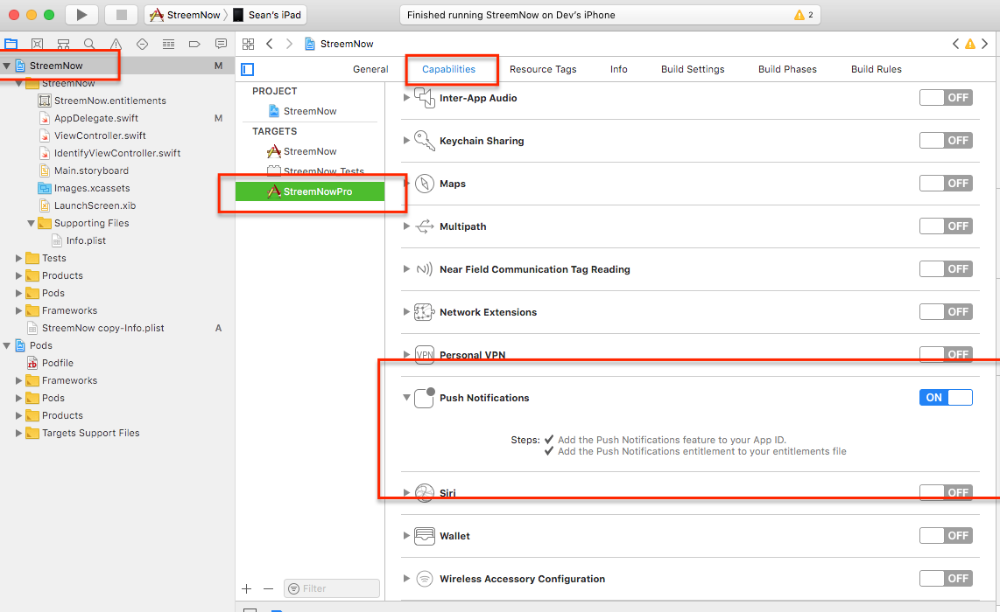
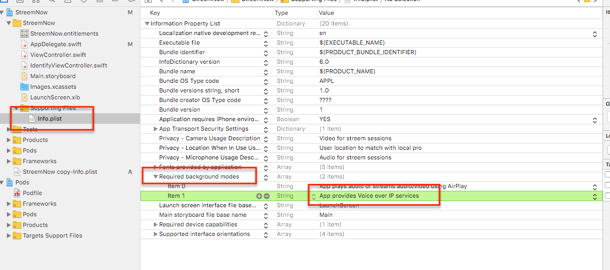
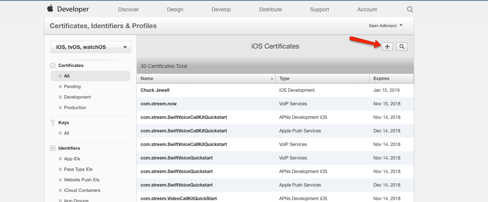
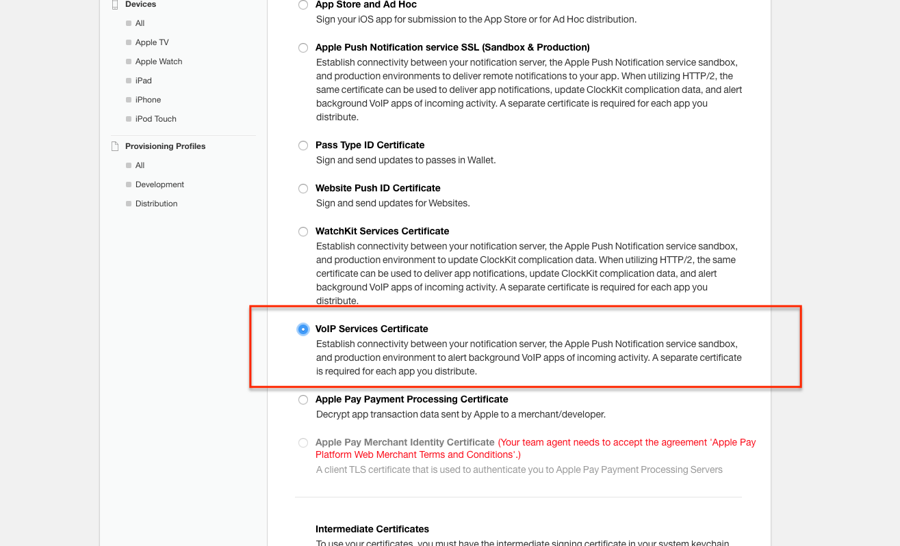
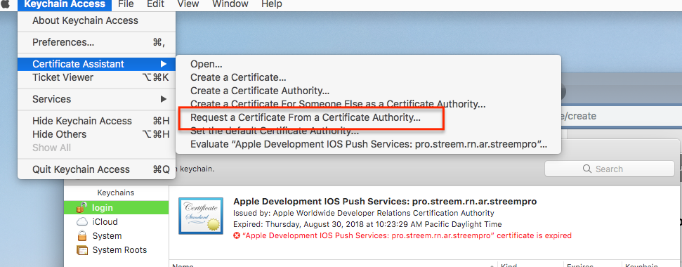
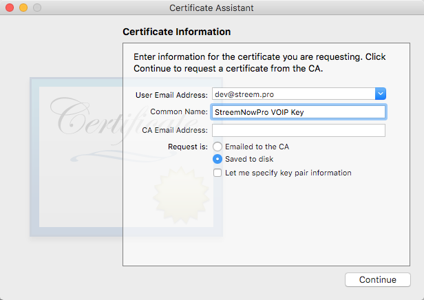
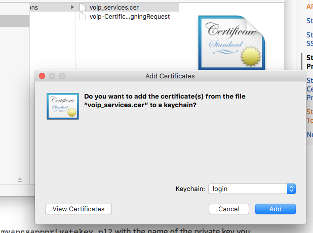
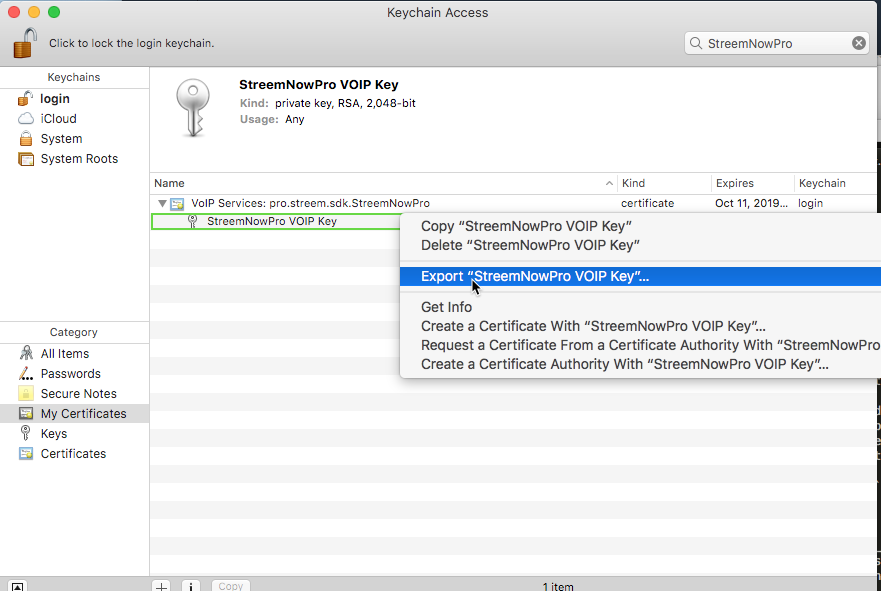

Setting up CallKit
==================

Follow these instructions to setup your app with CallKit push notifications, which allow phone-call like functionality, even if the app has been killed in the background.

### Configure your App to use VOIP and Push Notifications in Xcode
* Open your app in Xcode
* Select your App Target, open Capabilities, and enable Push notifications 
* Open your Info.plist file, and add `voip` to the list of required background modes
```
	<key>UIBackgroundModes</key>
	<array>
		<string>voip</string>
	</array>
```


### Get a VOIP Certificate from Apple

* Login to the Apple Developer Portal, and go to Certificates, Identifiers & Profiles
* Under Identifiers > App IDs, ensure the app exists that you are creating a certificate for (add the App if it does not exist)
* Go to Certificates > All, and tap the Plus icon to add a new certificate 
* Select VoIP Services Certificate, and tap Continue 
* Select the Bundle ID of the app you are generating a certificate for
* On the Create a CSR file screen, stop and open the Keychain Access app on your Mac
* From the Mac toolbar, select Keychain Access > Certificate Assistant > Request a Certificate from a Certificate Authority 
* Enter your email address in the first field, and in "Common Name", simply enter a descriptive name for your key (e.g. Streem VOIP Key)
* Leave CA Email Address field blank, select Save to Disk, and Continue 
* Save the file to disk in a place you can grab in a moment
* Back in the Apple portal, select Continue.
* On the next screen, select to upload the CSR you just generated, and click Continue
* The final screen allows you to download your generated certificate
* Save the `voip_services.cer` file in a known location, and tap Done


### Extract PEM file

* Open Terminal to your `voip_services.cer` file
* Run `openssl x509 -in voip_services.cer -inform DER -outform PEM -out voip_cert.pem`
* You now have a `voip_cert.pem`


### Extract Private Key

* Import your `voip_services.cer` file into Keychain Access by double-clicking it from Finder
* Select login for the keychain to import to 
* Find the certificate under My Certificates
* Extend the cert to expose the private key
* Right click the private key and select "Export (key)..." 
* You can leave the password blank if you like
* Save the `Certificates.p12` file to disk
* Open terminal to the newly created p12 file
* Run `openssl pkcs12 -in Certificates.p12 -out voip_key.pem -nodes -clcerts`
* Enter the cert password, or leave blank if you didn't create one previously
* You now have a `voip_key.pem` file


### Verify Cert and Key files

* You should have a `voip_cert.pem` file, and a `voip_key.pem` file
* Open terminal to these files
* Run `openssl s_client -connect gateway.sandbox.push.apple.com:2195 -cert voip_cert.pem -key voip_key.pem`
* You should see output like the following:
```
SSL-Session:
    Protocol  : TLSv1.2
    Cipher    : DES-CBC3-SHA
    Session-ID:
    Session-ID-ctx:
    Master-Key: ########################################################################################
    Start Time: 1539275148
    Timeout   : 300 (sec)
    Verify return code: 0 (ok)
```
* Your private key and certificate are good to go!


### Send Streem your Certificate and Private Key

Streem needs these files so that we can send VOIP notifications on your behalf. Contact us at [sdk-support@streem.com](mailto:sdk-support@streem.com) for details on how to send us the files.

We do a PUT to our servers with these credentials; if you'd rather try doing this yourself, let us know in the email and we can work with you on that.
